# FIEBDC-3 round trip — report

Question: when someone reads an ordinary budget into Open Calc Studio as
.bc3 and writes it out as .bc3 again, what comes out — nothing added,
nothing lost? Tested with 21 real files from the internet (Presto 7 to 25,
Arquímedes, TCQ, ppl, pyCost, the Andalusian cost database BCCA 2023) plus
one synthetic example; origin and peculiarities per file are in
[README.md](README.md).

Two questions are answered. **A versus B**: the budget in Open Calc Studio
before the export against the budget after re-importing the export — this
is the round trip proper. **A versus the file**: our bottom-up calculation
against the prices the source program stored in the file (root, chapters,
items) — this shows where a source file is internally inconsistent, where
the source program rounds differently, or where its totals contain costs
that are not in the file.

The block "Measurements" below is written by the test itself
(`npx vitest run src/test/bc3Roundtrip.test.ts`); the text after it is
written by hand.

<!-- gegenereerd:begin -->
## Measurements

Generated by `src/test/bc3Roundtrip.test.ts` (`npx vitest run src/test/bc3Roundtrip.test.ts`).
Round trip: import the file (A) → export as .bc3 (Windows-1252) → import again (B) → compare A and B row by row.
Tolerance for amounts: 0.01. "Items" counts chapters, items and resource rows after `recalculateItems`.
"Root price in file" is the price on the `##` concept of the original file; "Deviation" compares our bottom-up direct cost (A) with it.

## Summary

- Files: 22
- Identical after the round trip (no field differs): 21
- Amounts, descriptions, quantities and structure equal, only a code with an `_n` suffix: 1
- With other differences: 0
- Files with a usable root price (non-zero, no missing concepts): 12, of which within 0.01 % of our direct cost: 8
- Fragments (the file references concepts it does not contain, or its root has no breakdown): 3 (`pycost_measurement_outside_chapter.bc3`, `pycost_test_file_11.bc3`, `pycost_test_parametric_02.bc3`)

## Per file

| File | Program / version | Charset | Items A | Items B | Direct cost A | Direct cost B | Rows differing | Root price in file | Deviation of import vs. file |
| --- | --- | --- | ---: | ---: | ---: | ---: | ---: | ---: | ---: |
| `BCCA2023_V02.bc3` | Presto 22.01 — FIEBDC-3/2020 | ANSI | 46215 | 46215 | 8,705,795.76 | 8,705,795.76 | 0 | 0.00 | no root price (0) |
| `corsam_presupuesto.bc3` | Presto 8.8 — FIEBDC-3/2002 | ANSI | 118 | 118 | 887,295.40 | 887,295.40 | 0 | 298,189.46 | 197.56 % |
| `fjht_018-12_con_resumen.bc3` | ARPO-BC3 — FIEBDC-3/2002 | ANSI | 207 | 207 | 434,687.43 | 434,687.43 | 0 | 434,687.42 | 0.00 % |
| `fjht_018-12.bc3` | Presto 11.02 — FIEBDC-3/2002 | ANSI | 207 | 207 | 434,687.43 | 434,687.43 | 0 | 434,687.42 | 0.00 % |
| `fjht_prueba.bc3` | Presto 11.02 — FIEBDC-3/2002 | ANSI | 6 | 6 | 42.50 | 42.50 | 0 | 42.50 | 0.00 % |
| `fjht_vua1.bc3` | Predimensionador para viviendas unifamiliares aisladas — FIE | ANSI | 1600 | 1600 | 176,553.34 | 176,553.34 | 0 | 0.00 | no root price (0) |
| `pycost_guadix.bc3` | ppl 0.1 — FIEBDC-3/95 | (none) | 2773 | 2773 | 1,474,153,917.66 | 1,474,153,917.66 | 0 | 1,474,153,876.25 | 0.00 % |
| `pycost_measurement_outside_chapter.bc3` | Pr22.03 — FIEBDC-3/2020 | ANSI | 80 | 80 | 261,178.14 | 261,178.14 | 0 | 65,324,446.79 | -99.60 % (fragment: 8 referenced concepts missing) |
| `pycost_planta.bc3` | ppl 0.1 — FIEBDC-3/95 | (none) | 351 | 351 | 119,237,094.99 | 119,237,094.99 | 2 | 119,237,089.04 | 0.00 % |
| `pycost_pp.bc3` | ? — ? | (none) | 1 | 1 | 0.00 | 0.00 | 0 | n/a | n/a |
| `pycost_ref_write_01.bc3` | pyCost 0.2 — FIEBDC-3/2020 | ANSI | 114 | 114 | 1,356,377.94 | 1,356,377.94 | 0 | 1,356,866.66 | -0.04 % |
| `pycost_sch_base.bc3` | ppl 0.1 — FIEBDC-3/95 | (none) | 895 | 895 | 1,403,378,626.36 | 1,403,378,626.36 | 0 | 1,132,583,228.56 | 23.91 % |
| `pycost_sispre_murcia5.bc3` | Presto 7.00 — FIEBDC-3/95 | (none) | 2155 | 2155 | 845,179,389.75 | 845,179,389.75 | 0 | 845,180,002.00 | -0.00 % |
| `pycost_sispre_PUEBLA-EE.bc3` | TCQ 2.1 — FIEBDC-3/98 | ANSI | 430 | 430 | 23,766,555.55 | 23,766,555.55 | 0 | n/a | n/a |
| `pycost_sispre_puebla-oc.bc3` | TCQ 2.1 — FIEBDC-3/98 | ANSI | 1453 | 1453 | 32,520,698.10 | 32,520,698.10 | 0 | n/a | n/a |
| `pycost_test_file_05.bc3` | ARQUIMEDES — FIEBDC-3/2004 | ANSI | 800 | 800 | 683,760.15 | 683,760.15 | 0 | 697,444.60 | -1.96 % |
| `pycost_test_file_06.bc3` | Generador de precios de la construcción. CYPE Ingenieros, S. | ANSI | 9 | 9 | 2.14 | 2.14 | 0 | n/a | n/a |
| `pycost_test_file_11.bc3` | TEST — FIEBDC-3/2016 | 850 | 31 | 31 | 974.41 | 974.41 | 0 | 390,352.04 | -99.75 % (fragment: root has no breakdown) |
| `pycost_test_parametric_02.bc3` | pyCost 1.0 — FIEBDC-3/2007 | utf-8 | 1 | 1 | 0.00 | 0.00 | 0 | n/a | n/a |
| `synthetisch-voorbeeld.bc3` | Open Calc Studio — FIEBDC-3/2004 | ANSI | 5 | 5 | 119.50 | 119.50 | 0 | 119.50 | 0.00 % |
| `tocbim_FirstStreet_corridor_PRES.bc3` | IFC2BC3_Claude — FIEBDC-3/2012 | ANSI | 15 | 15 | 162,087.66 | 162,087.66 | 0 | 162,087.65 | 0.00 % |
| `tocbim_MVC-Brises.bc3` | Presto 25.00 — FIEBDC-3/2020 | ANSI | 575 | 575 | 0.00 | 0.00 | 0 | 0.00 | no root price (0) |

## Import against the file itself

Chapters: our total against the `~C` price of the chapter (only chapters with a non-zero price in the file). Items: our bottom-up unit price against the `~C` price of the item; "net effect" is Σ(difference × quantity) over all priced items, i.e. what the stored unit prices would add to or remove from our direct cost.

| File | Chapters priced | Chapters differing (> 0.01) | Largest chapter difference | Items priced | Items differing (> 0.005) | Net effect on direct cost | Largest item difference |
| --- | ---: | ---: | ---: | ---: | ---: | ---: | ---: |
| `BCCA2023_V02.bc3` | 10 | 0 | -0.00 (`01UJJ00020`) | 11772 | 1752 | -7.02 | -0.0306 (`08EAW00010`) |
| `corsam_presupuesto.bc3` | 16 | 9 | 496,129.32 (`C15`) | 101 | 0 | 0.00 | 0.0000 (``) |
| `fjht_018-12_con_resumen.bc3` | 9 | 1 | 0.01 (`02`) | 198 | 0 | 0.00 | 0.0000 (``) |
| `fjht_018-12.bc3` | 9 | 1 | 0.01 (`02`) | 198 | 0 | 0.00 | 0.0000 (``) |
| `fjht_prueba.bc3` | 2 | 0 | 0.00 (``) | 4 | 0 | 0.00 | 0.0000 (``) |
| `fjht_vua1.bc3` | 0 | 0 | — | 0 | 0 | 0.00 | — |
| `pycost_guadix.bc3` | 53 | 18 | 46.16 (`1`) | 417 | 0 | 0.00 | -0.0000 (`05.043`) |
| `pycost_measurement_outside_chapter.bc3` | 5 | 5 | -6,686,612.54 (`02`) | 12 | 3 | -1.35 | -0.0140 (`G0920N016`) |
| `pycost_planta.bc3` | 19 | 9 | 9.05 (`10`) | 166 | 0 | -0.00 | -0.0000 (`030.003.1`) |
| `pycost_pp.bc3` | 0 | 0 | — | 0 | 0 | 0.00 | — |
| `pycost_ref_write_01.bc3` | 2 | 2 | -488.72 (`01`) | 17 | 1 | -546.57 | 0.0051 (`680.0010`) |
| `pycost_sch_base.bc3` | 41 | 16 | 270,795,490.00 (`2`) | 427 | 2 | 270,795,490.00 | 136495885.0000 (`1205`) |
| `pycost_sispre_murcia5.bc3` | 42 | 40 | -355.82 (`4`) | 454 | 30 | -615.37 | -0.0103 (`0086`) |
| `pycost_sispre_PUEBLA-EE.bc3` | 0 | 0 | — | 82 | 80 | -1,030,935.45 | -230911.0800 (`G3020810`) |
| `pycost_sispre_puebla-oc.bc3` | 0 | 0 | — | 249 | 244 | -5,080.96 | -10.6157 (`EE104165`) |
| `pycost_test_file_05.bc3` | 17 | 17 | -12,732.16 (`CAPITULO1`) | 152 | 49 | -18.57 | -0.0183 (`ENCOFenol1`) |
| `pycost_test_file_06.bc3` | 0 | 0 | — | 0 | 0 | 0.00 | — |
| `pycost_test_file_11.bc3` | 0 | 0 | — | 5 | 4 | -8.24 | -9.1783 (`CM1E03MH010`) |
| `pycost_test_parametric_02.bc3` | 0 | 0 | — | 0 | 0 | 0.00 | — |
| `synthetisch-voorbeeld.bc3` | 1 | 0 | 0.00 (``) | 2 | 0 | 0.00 | 0.0000 (``) |
| `tocbim_FirstStreet_corridor_PRES.bc3` | 5 | 0 | 0.00 (`01`) | 10 | 0 | 0.00 | 0.0000 (``) |
| `tocbim_MVC-Brises.bc3` | 0 | 0 | — | 0 | 0 | 0.00 | — |

### BCCA2023_V02.bc3

- Owner: RIB Spain; program: Presto 22.01; format: FIEBDC-3/2020; charset: ANSI
- Size: 4,376,644 bytes, 35,920 lines
- Items A: 46215 (chapter 2914, begrotingspost 11802, regel 31499); items B: 46215
- Direct cost A: 8,705,795.76; B: 8,705,795.76; difference: 0.00
- Root price according to the file: 0.00 (import deviates no root price (0))
- Chapters with a price in the file: 10, differing from our total: 0 (largest: -0.00 on `01UJJ00020`)
- Items with a price in the file: 11772, unit price differing from the composition: 1752 (net effect -7.02; largest -0.0306 on `08EAW00010`)
- Texts (~T) as notes: A 34965 items (91 multi-line), B 34965 (91 multi-line)
- Chapter totals differing between A and B: 0
- Charset of the export: ANSI
- Record types in the original: ~C 15514, ~D 8426, ~K 1, ~L 1, ~T 11532, ~V 1, ~X 1
- Record types in the export: ~C 15514, ~D 8422, ~M 11802, ~T 11532, ~V 1
- Warnings on import A (1):
  - For 2 items the sum of the breakdown differs by more than 2%…
- Warnings on import B (1): For 1 item the sum of the breakdown differs by more than 2% 
- Differences A vs. B: none

### corsam_presupuesto.bc3

- Owner: SOFT S.A.; program: Presto 8.8; format: FIEBDC-3/2002; charset: ANSI
- Size: 80,557 bytes, 546 lines
- Items A: 118 (chapter 16, begrotingspost 102); items B: 118
- Direct cost A: 887,295.40; B: 887,295.40; difference: 0.00
- Root price according to the file: 298,189.46 (import deviates 197.56 %)
- Chapters with a price in the file: 16, differing from our total: 9 (largest: 496,129.32 on `C15`)
- Items with a price in the file: 101, unit price differing from the composition: 0 (net effect 0.00; largest 0.0000 on ``)
- Texts (~T) as notes: A 95 items (14 multi-line), B 95 (14 multi-line)
- Chapter totals differing between A and B: 0
- Charset of the export: ANSI
- Record types in the original: ~A 3, ~C 184, ~D 51, ~K 1, ~M 102, ~T 108, ~V 1
- Record types in the export: ~C 119, ~D 17, ~M 102, ~T 95, ~V 1
- Warnings on import A (1):
  - One or more items have a breakdown without yields — the unit…
- Differences A vs. B: none

### fjht_018-12_con_resumen.bc3

- Owner: SOFT S.A.; program: ARPO-BC3; format: FIEBDC-3/2002; charset: ANSI
- Size: 72,938 bytes, 623 lines
- Items A: 207 (chapter 9, begrotingspost 198); items B: 207
- Direct cost A: 434,687.43; B: 434,687.43; difference: 0.00
- Root price according to the file: 434,687.42 (import deviates 0.00 %)
- Chapters with a price in the file: 9, differing from our total: 1 (largest: 0.01 on `02`)
- Items with a price in the file: 198, unit price differing from the composition: 0 (net effect 0.00; largest 0.0000 on ``)
- Texts (~T) as notes: A 198 items (5 multi-line), B 198 (5 multi-line)
- Chapter totals differing between A and B: 0
- Charset of the export: ANSI
- Record types in the original: ~C 208, ~D 10, ~K 1, ~M 198, ~T 198, ~V 1
- Record types in the export: ~C 208, ~D 10, ~M 198, ~T 198, ~V 1
- Warnings on import A: none
- Differences A vs. B: none

### fjht_018-12.bc3

- Owner: SOFT S.A.; program: Presto 11.02; format: FIEBDC-3/2002; charset: ANSI
- Size: 71,144 bytes, 623 lines
- Items A: 207 (chapter 9, begrotingspost 198); items B: 207
- Direct cost A: 434,687.43; B: 434,687.43; difference: 0.00
- Root price according to the file: 434,687.42 (import deviates 0.00 %)
- Chapters with a price in the file: 9, differing from our total: 1 (largest: 0.01 on `02`)
- Items with a price in the file: 198, unit price differing from the composition: 0 (net effect 0.00; largest 0.0000 on ``)
- Texts (~T) as notes: A 198 items (5 multi-line), B 198 (5 multi-line)
- Chapter totals differing between A and B: 0
- Charset of the export: ANSI
- Record types in the original: ~C 208, ~D 10, ~K 1, ~M 198, ~T 198, ~V 1
- Record types in the export: ~C 208, ~D 10, ~M 198, ~T 198, ~V 1
- Warnings on import A: none
- Differences A vs. B: none

### fjht_prueba.bc3

- Owner: SOFT S.A.; program: Presto 11.02; format: FIEBDC-3/2002; charset: ANSI
- Size: 442 bytes, 16 lines
- Items A: 6 (chapter 2, begrotingspost 4); items B: 6
- Direct cost A: 42.50; B: 42.50; difference: 0.00
- Root price according to the file: 42.50 (import deviates 0.00 %)
- Chapters with a price in the file: 2, differing from our total: 0 (largest: 0.00 on ``)
- Items with a price in the file: 4, unit price differing from the composition: 0 (net effect 0.00; largest 0.0000 on ``)
- Texts (~T) as notes: A 0 items (0 multi-line), B 0 (0 multi-line)
- Chapter totals differing between A and B: 0
- Charset of the export: ANSI
- Record types in the original: ~C 6, ~D 3, ~K 1, ~M 4, ~V 1
- Record types in the export: ~C 6, ~D 3, ~M 4, ~V 1
- Warnings on import A: none
- Differences A vs. B: none

### fjht_vua1.bc3

- Owner: CYPE INGENIEROS, S.A.; program: Predimensionador para viviendas unifamiliares aisladas; format: FIEBDC-3/2002; charset: ANSI
- Size: 385,812 bytes, 4,132 lines
- Items A: 1600 (chapter 67, begrotingspost 209, regel 1324); items B: 1600
- Direct cost A: 176,553.34; B: 176,553.34; difference: 0.00
- Root price according to the file: 0.00 (import deviates no root price (0))
- Chapters with a price in the file: 0, differing from our total: 0
- Items with a price in the file: 0, unit price differing from the composition: 0
- Texts (~T) as notes: A 209 items (209 multi-line), B 209 (209 multi-line)
- Chapter totals differing between A and B: 0
- Charset of the export: ANSI
- Record types in the original: ~C 789, ~D 277, ~K 1, ~M 209, ~T 209, ~V 1, ~X 211
- Record types in the export: ~C 789, ~D 277, ~M 209, ~T 209, ~V 1
- Warnings on import A: none
- Differences A vs. B: none

### pycost_guadix.bc3

- Owner: Iturribizia, S.L.; program: ppl 0.1; format: FIEBDC-3/95; charset: (not declared)
- Size: 161,013 bytes, 1,606 lines
- Items A: 2773 (chapter 53, begrotingspost 417, regel 2303); items B: 2773
- Direct cost A: 1,474,153,917.66; B: 1,474,153,917.66; difference: 0.00
- Root price according to the file: 1,474,153,876.25 (import deviates 0.00 %)
- Chapters with a price in the file: 53, differing from our total: 18 (largest: 46.16 on `1`)
- Items with a price in the file: 417, unit price differing from the composition: 0 (net effect 0.00; largest -0.0000 on `05.043`)
- Texts (~T) as notes: A 2720 items (0 multi-line), B 2720 (0 multi-line)
- Chapter totals differing between A and B: 0
- Charset of the export: ANSI
- Record types in the original: ~C 486, ~D 225, ~M 417, ~T 432, ~V 1, ~Y 44
- Record types in the export: ~C 397, ~D 227, ~M 417, ~T 343, ~V 1
- Warnings on import A: none
- Differences A vs. B: none

### pycost_measurement_outside_chapter.bc3

- Owner: RIB Spain; program: Pr22.03; format: FIEBDC-3/2020; charset: ANSI
- Size: 17,424 bytes, 226 lines
- Items A: 80 (chapter 5, begrotingspost 12, regel 63); items B: 80
- Direct cost A: 261,178.14; B: 261,178.14; difference: 0.00
- Root price according to the file: 65,324,446.79 (import deviates -99.60 % (fragment: 8 referenced concepts missing))
- Chapters with a price in the file: 5, differing from our total: 5 (largest: -6,686,612.54 on `02`)
- Items with a price in the file: 12, unit price differing from the composition: 3 (net effect -1.35; largest -0.0140 on `G0920N016`)
- Texts (~T) as notes: A 53 items (1 multi-line), B 53 (1 multi-line)
- Chapter totals differing between A and B: 0
- Charset of the export: ANSI
- Record types in the original: ~A 38, ~C 81, ~D 27, ~M 13, ~T 64, ~V 1
- Record types in the export: ~C 51, ~D 18, ~M 12, ~T 36, ~V 1
- Warnings on import A (8):
  - Unknown concept '02.03.01.01' under '02.03.01#' — skipped.
  - Unknown concept '02.03.01.02' under '02.03.01#' — skipped.
  - Unknown concept '02.03.01.03' under '02.03.01#' — skipped.
  - Unknown concept '02.03.01.04.01' under '02.03.01.04#' — skip…
  - Unknown concept '02.03.02' under '02.03#' — skipped.
  - Unknown concept '02.03.03' under '02.03#' — skipped.
- Differences A vs. B: none

### pycost_planta.bc3

- Owner: Iturribizia, S.L.; program: ppl 0.1; format: FIEBDC-3/95; charset: (not declared)
- Size: 85,242 bytes, 658 lines
- Items A: 351 (chapter 19, begrotingspost 166, regel 166); items B: 351
- Direct cost A: 119,237,094.99; B: 119,237,094.99; difference: 0.00
- Root price according to the file: 119,237,089.04 (import deviates 0.00 %)
- Chapters with a price in the file: 19, differing from our total: 9 (largest: 9.05 on `10`)
- Items with a price in the file: 166, unit price differing from the composition: 0 (net effect -0.00; largest -0.0000 on `030.003.1`)
- Texts (~T) as notes: A 166 items (1 multi-line), B 166 (1 multi-line)
- Chapter totals differing between A and B: 0
- Charset of the export: ANSI
- Record types in the original: ~C 170, ~D 151, ~M 166, ~T 149, ~V 1, ~Y 18
- Record types in the export: ~C 102, ~D 101, ~M 166, ~T 81, ~V 1
- Warnings on import A: none
- Differences A vs. B: 2 row(s), per field: code 2
  - item #31 code: `2` → `2_1`
  - item #84 code: `4.1` → `4.1_1`

### pycost_pp.bc3

- Owner: (empty); program: (empty); format: (empty); charset: (not declared)
- Size: 36,317 bytes, 501 lines
- Items A: 1 (chapter 1); items B: 1
- Direct cost A: 0.00; B: 0.00; difference: 0.00
- Chapters with a price in the file: 0, differing from our total: 0
- Items with a price in the file: 0, unit price differing from the composition: 0
- Texts (~T) as notes: A 0 items (0 multi-line), B 0 (0 multi-line)
- Chapter totals differing between A and B: 0
- Charset of the export: ANSI
- Record types in the original: ~M 500
- Record types in the export: ~C 2, ~D 1, ~V 1
- Warnings on import A (2):
  - No project structure (##/#) found — concepts were imported a…
  - This file contains no prices — only descriptions and quantit…
- Warnings on import B (1): This file contains no prices — only descriptions and quantit
- Differences A vs. B: none

### pycost_ref_write_01.bc3

- Owner: XC, S.L.; program: pyCost 0.2; format: FIEBDC-3/2020; charset: ANSI
- Size: 501,540 bytes, 197 lines
- Items A: 114 (chapter 2, begrotingspost 17, regel 95); items B: 114
- Direct cost A: 1,356,377.94; B: 1,356,377.94; difference: 0.00
- Root price according to the file: 1,356,866.66 (import deviates -0.04 %)
- Chapters with a price in the file: 2, differing from our total: 2 (largest: -488.72 on `01`)
- Items with a price in the file: 17, unit price differing from the composition: 1 (net effect -546.57; largest 0.0051 on `680.0010`)
- Texts (~T) as notes: A 110 items (0 multi-line), B 110 (0 multi-line)
- Chapter totals differing between A and B: 0
- Charset of the export: ANSI
- Record types in the original: ~C 78, ~D 26, ~K 1, ~M 17, ~T 73, ~V 1
- Record types in the export: ~C 64, ~D 20, ~M 17, ~T 60, ~V 1
- Warnings on import A: none
- Differences A vs. B: none

### pycost_sch_base.bc3

- Owner: Iturribizia, S.L.; program: ppl 0.1; format: FIEBDC-3/95; charset: (not declared)
- Size: 137,708 bytes, 1,526 lines
- Items A: 895 (chapter 41, begrotingspost 427, regel 427); items B: 895
- Direct cost A: 1,403,378,626.36; B: 1,403,378,626.36; difference: 0.00
- Root price according to the file: 1,132,583,228.56 (import deviates 23.91 %)
- Chapters with a price in the file: 41, differing from our total: 16 (largest: 270,795,490.00 on `2`)
- Items with a price in the file: 427, unit price differing from the composition: 2 (net effect 270,795,490.00; largest 136495885.0000 on `1205`)
- Texts (~T) as notes: A 854 items (0 multi-line), B 854 (0 multi-line)
- Chapter totals differing between A and B: 0
- Charset of the export: ANSI
- Record types in the original: ~C 380, ~D 345, ~M 427, ~T 338, ~V 1, ~Y 34
- Record types in the export: ~C 380, ~D 379, ~M 427, ~T 338, ~V 1
- Warnings on import A (1):
  - For 2 items the sum of the breakdown differs by more than 2%…
- Differences A vs. B: none

### pycost_sispre_murcia5.bc3

- Owner: SOFT S.A.; program: Presto 7.00; format: FIEBDC-3/95; charset: (not declared)
- Size: 131,075 bytes, 1,681 lines
- Items A: 2155 (chapter 42, begrotingspost 454, regel 1659); items B: 2155
- Direct cost A: 845,179,389.75; B: 845,179,389.75; difference: 0.00
- Root price according to the file: 845,180,002.00 (import deviates -0.00 %)
- Chapters with a price in the file: 42, differing from our total: 40 (largest: -355.82 on `4`)
- Items with a price in the file: 454, unit price differing from the composition: 30 (net effect -615.37; largest -0.0103 on `0086`)
- Texts (~T) as notes: A 675 items (0 multi-line), B 675 (0 multi-line)
- Chapter totals differing between A and B: 0
- Charset of the export: ANSI
- Record types in the original: ~C 552, ~D 293, ~M 454, ~T 378, ~V 1
- Record types in the export: ~C 444, ~D 240, ~M 454, ~T 281, ~V 1
- Warnings on import A: none
- Differences A vs. B: none

### pycost_sispre_PUEBLA-EE.bc3

- Owner: (empty); program: TCQ 2.1; format: FIEBDC-3/98; charset: ANSI
- Size: 37,417 bytes, 458 lines
- Items A: 430 (chapter 32, begrotingspost 82, regel 316); items B: 430
- Direct cost A: 23,766,555.55; B: 23,766,555.55; difference: -0.00
- Chapters with a price in the file: 0, differing from our total: 0
- Items with a price in the file: 82, unit price differing from the composition: 80 (net effect -1,030,935.45; largest -230911.0800 on `G3020810`)
- Texts (~T) as notes: A 322 items (0 multi-line), B 322 (0 multi-line)
- Chapter totals differing between A and B: 0
- Charset of the export: ANSI
- Record types in the original: ~C 185, ~D 107, ~M 82, ~T 80, ~V 1
- Record types in the export: ~C 185, ~D 107, ~M 82, ~T 80, ~V 1
- Warnings on import A (1):
  - For 79 items the sum of the breakdown differs by more than 2…
- Differences A vs. B: none

### pycost_sispre_puebla-oc.bc3

- Owner: (empty); program: TCQ 2.1; format: FIEBDC-3/98; charset: ANSI
- Size: 88,373 bytes, 937 lines
- Items A: 1453 (chapter 40, begrotingspost 249, regel 1164); items B: 1453
- Direct cost A: 32,520,698.10; B: 32,520,698.10; difference: 0.00
- Chapters with a price in the file: 0, differing from our total: 0
- Items with a price in the file: 249, unit price differing from the composition: 244 (net effect -5,080.96; largest -10.6157 on `EE104165`)
- Texts (~T) as notes: A 1172 items (0 multi-line), B 1172 (0 multi-line)
- Chapter totals differing between A and B: 0
- Charset of the export: ANSI
- Record types in the original: ~C 340, ~D 138, ~K 1, ~M 249, ~T 207, ~V 1
- Record types in the export: ~C 337, ~D 137, ~M 249, ~T 205, ~V 1
- Warnings on import A: none
- Differences A vs. B: none

### pycost_test_file_05.bc3

- Owner: CYPE INGENIEROS, S.A.; program: ARQUIMEDES; format: FIEBDC-3/2004; charset: ANSI
- Size: 151,244 bytes, 2,028 lines
- Items A: 800 (chapter 17, begrotingspost 152, regel 631); items B: 800
- Direct cost A: 683,760.15; B: 683,760.15; difference: 0.00
- Root price according to the file: 697,444.60 (import deviates -1.96 %)
- Chapters with a price in the file: 17, differing from our total: 17 (largest: -12,732.16 on `CAPITULO1`)
- Items with a price in the file: 152, unit price differing from the composition: 49 (net effect -18.57; largest -0.0183 on `ENCOFenol1`)
- Texts (~T) as notes: A 481 items (3 multi-line), B 481 (3 multi-line)
- Chapter totals differing between A and B: 0
- Charset of the export: ANSI
- Record types in the original: ~A 9, ~C 341, ~D 133, ~K 1, ~M 59, ~T 299, ~V 1
- Record types in the export: ~C 331, ~D 124, ~M 152, ~T 293, ~V 1
- Warnings on import A: none
- Differences A vs. B: none

### pycost_test_file_06.bc3

- Owner: CYPE Ingenieros S.A.; program: Generador de precios de la construcción. CYPE Ingenieros, S.A.; format: FIEBDC-3/2016; charset: ANSI
- Size: 4,593 bytes, 115 lines
- Items A: 9 (chapter 3, begrotingspost 1, regel 5); items B: 9
- Direct cost A: 2.14; B: 2.14; difference: 0.00
- Chapters with a price in the file: 0, differing from our total: 0
- Items with a price in the file: 0, unit price differing from the composition: 0
- Texts (~T) as notes: A 6 items (1 multi-line), B 6 (1 multi-line)
- Chapter totals differing between A and B: 0
- Charset of the export: ANSI
- Record types in the original: ~C 15, ~D 5, ~K 1, ~L 1, ~M 1, ~R 2, ~T 11, ~V 1, ~X 7
- Record types in the export: ~C 10, ~D 5, ~M 1, ~T 6, ~V 1
- Warnings on import A: none
- Differences A vs. B: none

### pycost_test_file_11.bc3

- Owner: TEST; program: TEST; format: FIEBDC-3/2016; charset: 850
- Size: 7,587 bytes, 98 lines
- Items A: 31 (begrotingspost 5, regel 26); items B: 31
- Direct cost A: 974.41; B: 974.41; difference: 0.00
- Root price according to the file: 390,352.04 (import deviates -99.75 % (fragment: root has no breakdown))
- Chapters with a price in the file: 0, differing from our total: 0
- Items with a price in the file: 5, unit price differing from the composition: 4 (net effect -8.24; largest -9.1783 on `CM1E03MH010`)
- Texts (~T) as notes: A 10 items (0 multi-line), B 10 (0 multi-line)
- Chapter totals differing between A and B: 0
- Charset of the export: ANSI
- Record types in the original: ~C 34, ~D 9, ~K 1, ~T 10, ~V 1
- Record types in the export: ~C 29, ~D 6, ~M 5, ~T 10, ~V 1
- Warnings on import A (2):
  - No root structure (##) with a breakdown found — separate bra…
  - For 1 item the sum of the breakdown differs by more than 2% …
- Differences A vs. B: none

### pycost_test_parametric_02.bc3

- Owner: (empty); program: pyCost 1.0; format: FIEBDC-3/2007; charset: utf-8
- Size: 5,377 bytes, 121 lines
- Items A: 1 (begrotingspost 1); items B: 1
- Direct cost A: 0.00; B: 0.00; difference: 0.00
- Chapters with a price in the file: 0, differing from our total: 0
- Items with a price in the file: 0, unit price differing from the composition: 0
- Texts (~T) as notes: A 0 items (0 multi-line), B 0 (0 multi-line)
- Chapter totals differing between A and B: 0
- Charset of the export: ANSI
- Record types in the original: ~C 26, ~D 1, ~P 1, ~T 2, ~V 1
- Record types in the export: ~C 2, ~D 1, ~M 1, ~V 1
- Warnings on import A (3):
  - Unknown concept 'AAA020$' under 'AAA#' — skipped.
  - Unknown concept 'AAA030$' under 'AAA#' — skipped.
  - This file contains no prices — only descriptions and quantit…
- Warnings on import B (1): This file contains no prices — only descriptions and quantit
- Differences A vs. B: none

### synthetisch-voorbeeld.bc3

- Owner: (empty); program: Open Calc Studio; format: FIEBDC-3/2004; charset: ANSI
- Size: 483 bytes, 14 lines
- Items A: 5 (chapter 1, begrotingspost 2, regel 2); items B: 5
- Direct cost A: 119.50; B: 119.50; difference: 0.00
- Root price according to the file: 119.50 (import deviates 0.00 %)
- Chapters with a price in the file: 1, differing from our total: 0 (largest: 0.00 on ``)
- Items with a price in the file: 2, unit price differing from the composition: 0 (net effect 0.00; largest 0.0000 on ``)
- Texts (~T) as notes: A 1 items (0 multi-line), B 1 (0 multi-line)
- Chapter totals differing between A and B: 0
- Charset of the export: ANSI
- Record types in the original: ~C 6, ~D 3, ~M 2, ~T 1, ~V 1
- Record types in the export: ~C 6, ~D 3, ~M 2, ~T 1, ~V 1
- Warnings on import A: none
- Differences A vs. B: none

### tocbim_FirstStreet_corridor_PRES.bc3

- Owner: (empty); program: IFC2BC3_Claude; format: FIEBDC-3/2012; charset: ANSI
- Size: 6,822 bytes, 50 lines
- Items A: 15 (chapter 5, begrotingspost 10); items B: 15
- Direct cost A: 162,087.66; B: 162,087.66; difference: 0.00
- Root price according to the file: 162,087.65 (import deviates 0.00 %)
- Chapters with a price in the file: 5, differing from our total: 0 (largest: 0.00 on `01`)
- Items with a price in the file: 10, unit price differing from the composition: 0 (net effect 0.00; largest 0.0000 on ``)
- Texts (~T) as notes: A 15 items (0 multi-line), B 15 (0 multi-line)
- Chapter totals differing between A and B: 0
- Charset of the export: ANSI
- Record types in the original: ~C 16, ~D 6, ~K 1, ~M 10, ~T 15, ~V 1
- Record types in the export: ~C 16, ~D 6, ~M 10, ~T 15, ~V 1
- Warnings on import A: none
- Differences A vs. B: none

### tocbim_MVC-Brises.bc3

- Owner: RIB Spain; program: Presto 25.00; format: FIEBDC-3/2020; charset: ANSI
- Size: 522,978 bytes, 3,975 lines
- Items A: 575 (chapter 166, begrotingspost 409); items B: 575
- Direct cost A: 0.00; B: 0.00; difference: 0.00
- Root price according to the file: 0.00 (import deviates no root price (0))
- Chapters with a price in the file: 0, differing from our total: 0
- Items with a price in the file: 0, unit price differing from the composition: 0
- Texts (~T) as notes: A 409 items (353 multi-line), B 409 (353 multi-line)
- Chapter totals differing between A and B: 0
- Charset of the export: ANSI
- Record types in the original: ~C 481, ~D 158, ~G 1, ~K 1, ~L 1, ~M 206, ~T 313, ~V 1, ~X 6
- Record types in the export: ~C 471, ~D 157, ~M 409, ~T 304, ~V 1
- Warnings on import A (1):
  - This file contains no prices — only descriptions and quantit…
- Warnings on import B (1): This file contains no prices — only descriptions and quantit
- Differences A vs. B: none

<!-- gegenereerd:einde -->

## Deviations explained

"Deviation of import vs. file" compares our direct cost (A) with the price
on the `##` root concept of the original. Every file whose deviation is not
0.00 %, or that has no usable root price, is explained below with the
records that cause it. Status per file: **fixed** (an importer bug, now
repaired), **source file inconsistent** (the stored prices do not follow
from the file's own items and quantities), **rounding in the source
program**, **costs outside the file** (indirect costs the source program
adds to its totals but does not store), or **fragment** (the root price
belongs to a larger project). All amounts are as written in the files
(euros or pesetas, as the case may be).

### `corsam_presupuesto.bc3` — +197.56 % — source file inconsistent

File: 298,189.46 on the root; ours: 887,295.40.

The root price is exactly the sum of the sixteen stored chapter prices
(298,189.46), so root and chapters agree with each other. The chapters do
not agree with their own items. Chapter `C15`:

```
~C|C15#||REVESTIMIENTOS|48338.18|190825|0|
~D|C15#|15.03\1\108.3\TIGNF\1\110.3\TAB04\1\20.8\15.05\1\15.25\…\FP1\1\1\|
~M|C15#\15.03|7\1\|108.3|\\2\30\\\\\1\2.8\\17.25\|
~C|15.03|M2|SATE STOTHERM CLASSIC 8CM|2485.63|190825|0|
```

The first item alone is 108.3 × 2,485.63 = 269,193.73, more than five times
the stored chapter price; the twelve items of `C15` add up to 544,467.50.
Yield in `~D` and total in `~M` agree (108.3), and every one of the 101 item
prices reproduces from its composition (0 items differ), so the item level
is consistent — only the chapter and root prices are stale. Nine of the
sixteen chapters differ, in both directions (`C15` +496,129.32, `00`
−6,755.94: six items with quantity 1 that add up to 7,222.31 against a
stored 13,978.25); the other seven agree to the cent (`C02.00` −0.02,
`C14` −0.01 are rounding). The root and six other records carry price date
`040716`, the remaining 112 records `190825`: the item prices were updated,
the chapter and root prices were not. A program that recalculates on
opening shows 887,295.40; one that displays the stored prices shows
298,189.46. We recalculate.

### `pycost_ref_write_01.bc3` — −0.04 % — rounding in the source program

File: 1,356,866.66 on the root and on chapter `01`/`01.01`; ours:
1,356,377.94 (−488.72).

The item prices in the file are the composition prices rounded to 2
decimals, but the compositions are written with yields of only 3 decimals,
so the file's own numbers do not reproduce its prices either:

```
~C|680.0010|m²|ENCOFRADO OCULTO PLANO|26.82|040400|0|
~D|680.0010|MO00000002\1.000\0.020\MO00000003\1.000\0.250\MO00000004\1.000\0.400\Q140000A01\1.000\0.100\…|
~C|MO00000002|h|Capataz|21.98|040400|1|
```

As written, the composition of `680.0010` adds up to 26.8251, which would
round to 26.83 — the file says 26.82, so pyCost computed it with more
precise yields than it wrote. Across the 17 items the 2-decimal prices ×
quantities give 1,356,924.51 (+57.85 against the stored chapter), our
unrounded compositions 1,356,377.94 (−488.72). The largest single effect is
`600.0010`: 124,102.47 m³ × (1.72 − 1.71786) = 265.58. The composition is
what the file contains, so we use it.

### `pycost_sch_base.bc3` — +23.91 % — source file inconsistent

File: 1,132,583,228.56 on the root; ours: 1,403,378,626.36 (+270,795,397.80).

Two items have a placeholder price of 1 while their composition says 134
and 136 million pesetas:

```
~C|1201|ud|Turbina Francis de eje vertical, caudal máximo 27 m3/s, …|1|040400|0|
~D|1201|SINDESCO\1\134299606\|
~C|1205|ud|Generador síncrono trifásico de eje vertical 333,33 r.p.m. …|1|040400|0|
~D|1205|SINDESCO\1\136495886\|
~C|SINDESCO|***|Unidad sin descompuesto|1|040400|1|
~M|2_3\1201|2\3\1\|1|\\1\0\0\0\|
```

`SINDESCO` ("unit without breakdown") is a resource priced 1, so the yield
is the amount: 134,299,606 for the turbine, 136,495,886 for the generator,
quantity 1 each. The stored chapter price shows which number the source
program used: `~C|2_3||GRUPOS TURBINA-ALTERNADOR|207743854|` is exactly our
478,539,344 minus 270,795,490 (= 134,299,606 + 136,495,886 − 2), i.e. the
chapter and root totals were computed with 1 peseta per turbine and per
generator. Chapter `2` differs by the same 270,795,490. The remaining
92.20 on the root is ppl's chapter rounding (see `pycost_guadix` below). The
importer reports both amounts:

> For 2 items the sum of the breakdown differs by more than 2% from the
> unit price in the ~C record (e.g. 1201 (~C 1.00, ~D 134299606.00), 1205
> (~C 1.00, ~D 136495886.00)). The breakdown was used.

A user of the source program sees 1 peseta for the turbine and 1,132.6
million in total; we show 134.3 million and 1,403.4 million.

### `pycost_test_file_05.bc3` — −1.96 % — costs outside the file

File: 697,444.60 on the root; ours: 683,760.15 (−13,684.45). All 17 chapters
differ by about 2 %; the item prices differ by cents at most (net −18.57).

The chapter and root prices contain 2 % indirect costs ("costes
indirectos"), applied per item and rounded to 2 decimals; the percentage
itself is not in the file. Chapter `CAP1.1`:

```
~C|CAP1.1#||MOVIMIENTO DE TIERRAS|38433.52|021110|0|
~D|CAP1.1#|DMOVI3001\\5210\DSELECRI\\4689\RELL0301\\2125\DTERCAMINOS\\521\DTRTIERRAS\\605.605\DEMpav04a\\102\|
~C|DMOVI3001|M3|Excavación general del terreno …|2.53||0|
```

The six item prices are 2.53, 2.07, 2.50, 5.37, 10.43 and 3.66. Quantity ×
price gives 37,687.58; quantity × round(price × 1.02, 2) gives 5,210 × 2.58
+ 4,689 × 2.11 + 2,125 × 2.55 + 521 × 5.48 + 605.605 × 10.64 + 102 × 3.73 =
38,433.52, the stored chapter price to the cent. Over all 152 items the same
rule gives 697,444.61 against the stored root price of 697,444.60. A user of
Arquímedes sees the item at 2.53 and the project at 697,444.60 (with
indirect costs); we show the direct cost, 683,760.15. The 49 item prices that
differ by up to 0.018 are the 2-decimal auxiliary prices of the catalogue
(`DEXZANJAT` 3.06 against 3.054465 from its own composition), which
Arquímedes uses as resource prices; the same effect as in BCCA.

### `pycost_sispre_murcia5.bc3` — −0.00 % (−612.25 on 845 million) — rounding in the source program

Presto 7 works in pesetas: item prices are rounded to 2 decimals, item
totals to whole pesetas.

```
~C|0006|M3|Excavación en zanja de profun|466.67|181099|0|
~D|0006|01.004\1\.05\02.003\1\.08\%CI\1\.06\|
~C|01.004|H|Peón albañilería.|1125|181099|0|
~C|02.003|H|Retroexcavadora neumáticos.|4800|181099|0|
~C|%CI||COSTE INDIRECTO.|6|181099|2|
```

(0.05 × 1,125 + 0.08 × 4,800) × 1.06 = 466.665; the file says 466.67. With
41,611.92 m³ that item alone accounts for 208.06 of the difference. Chapter
`121` shows the second step: Σ quantity × 2-decimal price = 10,893,472.84,
rounded per item to whole pesetas 10,893,474 = the stored chapter price;
ours 10,893,450.35. Thirty of the 454 item prices differ by ≤ 0.0103; the
net effect is −615.37, the root difference −612.25.

### `pycost_guadix.bc3`, `pycost_planta.bc3` — 0.00 %, but 18 and 9 chapters differ — rounding in the source program

Every item price and every quantity in these two ppl 0.1 files matches ours
to the last decimal (`~C|02.006|…|282.6300019752|`, `~M|…|2587.2|`; 0 of
417 and 0 of 166 items differ), yet the stored chapter prices differ by up
to 46.16 (`1` in guadix, on 1.05 billion) and 9.05 (`10` in planta, on 25.8
million). Planta chapter `10`:

```
~C|10#||…|25794083.70|040400|0|
~Y|10|040.001\1\33250.6\060.001\1\1080\030.001\1\162\…|
```

Thirteen items with round prices (260, 2,700, 8,000, …) and the quantities
above add up to 25,794,092.75 — as a plain sum, as a sum of cent-rounded
item totals, or as a sum of peseta-rounded item totals. The stored
25,794,083.70 cannot be derived from the file's own numbers; it is ppl's
internal arithmetic. The root deviation stays at 0.00 % (41.41 on 1.47
billion, 5.95 on 119 million).

### `fjht_018-12.bc3`, `fjht_018-12_con_resumen.bc3` — 0.00 %, chapter `02` +0.01 — rounding in the source program

Presto 11 sums item totals rounded to the cent: for chapter `02`,
Σ round(quantity × price, 2) = 85,290.02, the unrounded sum 85,290.03. The
root (434,687.42 against our 434,687.43) has the same cause.

### `pycost_measurement_outside_chapter.bc3` — fragment (8 referenced concepts missing)

`~C|PC##||TEST|65324446.79|151198|0|` is the price of the complete project,
but the file is an excerpt: `~D|02.03.01#|02.03.01.01\1\1\02.03.01.02\1\1\
02.03.01.03\1\1\02.03.01.04\1\1\|` refers to four sub-chapters that have no
`~C` record (the same for `02.03.02`, `02.03.03` and two more). The
importer reports each one ("Unknown concept '02.03.01.01' under '02.03.01#'
— skipped."). The fragment contains 261,178.14; the five stored chapter
prices belong to the full chapters. Of the 12 items, 3 differ from their
composition by ≤ 0.014 (2-decimal auxiliary prices).

### `pycost_test_file_11.bc3` — fragment (root has no breakdown)

`~C|PRESUPUESTO_PASARELA_ALCORCON##||Pasarela Alcorcon.|390352.04|` has no
`~D`; the nine `~D` records describe five items and their compositions,
nothing above them. The importer imports the five items as separate
branches and says so ("No root structure (##) with a breakdown found —
separate branches were imported at the top level."). One item does not add
up:

```
~C|GAG030|ud|Proteccion de arbolado con tablones de madera|33.2|040400|0|
~D|GAG030|MOC0000100\\0.05\MOC0000500\\0.5\MN11080005\\1\%CIND\\0.06\|
```

The composition gives 34.14; the importer reports "GAG030 (~C 33.20, ~D
34.14)". `CM1E03MH010` gives 916.88 against a stored 926.06 (−1.0 %, below
the 2 % threshold); the table "Import against the file itself" shows that
−9.18 as the largest unit-price difference. (An earlier version of this
table showed −926.06 here: an item at the top level, without a chapter,
got no derived unit price in the calculator. Fixed — the top level now uses
the same roll-up as nested items.)

### `pycost_test_parametric_02.bc3` — fragment

`~C|ROOT##||BASE PRECIOS||12082022||` has no price. The decomposition
`~D|AAA#|OCA090$\\1.0000\AAA020$\\1.0000\AAA030$\\1.0000\|` refers to
parametric concepts (`$`) that are defined by `~P` records, which the
importer does not evaluate; two of the three are reported as unknown. One
item without a price remains.

### Files without a root price (`n/a` or 0)

- `pycost_pp.bc3`: 500 `~M` records and nothing else (no `~V`, `~C`, `~D`).
  The importer reports "No project structure (##/#) found" and produces one
  empty chapter.
- `pycost_sispre_PUEBLA-EE.bc3`, `pycost_sispre_puebla-oc.bc3` (TCQ 2.1):
  `~C|01##||EQUIPOS ELECTRICOS CIUDAD REAL|\|\||` — TCQ writes no root or
  chapter prices at all. The item prices are in pesetas, rounded to whole
  numbers, and in `PUEBLA-EE` they include 5 % indirect costs that are not
  in the file:

  ```
  ~C|G3020810\|UD|CENTRO DE CONTROL DE MOTORES DE PLANTA …| 4849136\|\|0|
  ~D|G3020810|BMATERII\\ 350000\BTRANSPO\\ 208721\AMONTAJE\ 1\ 874523\A%NAAR\ 1\ .04\|
  ~C|BMATERII\|X|MATERIAL EN ORIGEN.| 10\|\|3|
  ~C|AMONTAJE\|X|MONTAJE.| 1\|\|1|
  ~C|A%NAAR||Despeses auxiliars|1||3|
  ```

  350,000 × 10 + 208,721 × 1 + 874,523 × 1 + 4 % of the labour line
  (874,523) = 4,618,224.92; × 1.05 = 4,849,136.17 → 4,849,136 in the file.
  The importer reports 79 items ("For 79 items the sum of the breakdown
  differs by more than 2% …"); the net effect over the file is
  −1,030,935.45 on 23.77 million. In `puebla-oc` only the rounding to whole
  pesetas remains: `EE104020` = 0.002 × 1,364 + 0.004 × 1,257 + 1.06 × 102
  + 4 % of 7.756 = 115.916 → `116`; 244 of 249 items differ by less than a
  peseta, net −5,080.96 on 32.5 million (−0.016 %), no item above 2 %.
- `pycost_test_file_06.bc3`: `~C|root##|||||0|`, a price-book fragment of
  one item.
- `BCCA2023_V02.bc3`: a price book, root price 0. 1,752 of the 11,772 item
  prices differ from their composition by ≤ 0.031 (`08EAW00010` 163.06
  against 163.02939): the catalogue rounds auxiliary prices to 2 decimals
  and uses those as resource prices. Net effect −7.02 on 8.7 million. Two
  items exceed 2 % and are reported: `01TLL90100` (~C 0.25, ~D 0.24) and
  `15JWW90004` (~C 0.1300, ~D 0.1332).
- `fjht_vua1.bc3`: `~C|obra##||Vivienda unifamiliar aislada|0.00||0|`; the
  CYPE pre-dimensioning tool writes no root or chapter prices.
- `tocbim_MVC-Brises.bc3`: a measurement library without prices; the
  importer says so ("This file contains no prices …").

### The remaining `_n` suffix — `pycost_planta.bc3`

The only file that is not field-for-field identical after the round trip
differs in two codes: item #31 `2` → `2_1` and item #84 `4.1` → `4.1_1`.
The original uses the same chapter code twice for two different chapters:

```
~C|2#||Viales|23074659.9999999992979|040400|0|
~C|2#||Abastecimiento de agua|1618506.8499999999992|040400|0|
~D|PBlending|0\1\1.0000000000000\1\1\1.0000000000000\2\1\1.0000000000000\2\1\1.0000000000000\3\…|
~C|4.1#||Alumbrado|891450.0000000000224|040400|0|
~C|4.1#||Fuerza|765521.9999999999981|040400|0|
~D|4|4.1\1\1.0000000000000\4.1\1\1.0000000000000\|
```

Only their order tells them apart: the second `2` in the root's
decomposition is the second `~C|2#`. The importer keeps that order and
imports both chapters with all their items. FIEBDC-3 requires codes to be
unique, and readers look concepts up by code, so writing `2` twice would
make any other program (and a strict reading of ours) merge the two
chapters. The exporter therefore gives the second one `2_1`. Amounts,
descriptions, quantities, structure and chapter totals are identical; only
the code differs, and it cannot be otherwise in a conforming file.

## What is lost or added

The round trip compares the budget *in Open Calc Studio* before and after
the export (A against B). Separately, the original file was compared with
our export file (record counts, exporter code). These are two different
questions.

### Lost on import (has no place in the OCS model)

- **Measurement lines (`~M`, field 4).** The detail lines of a measurement —
  comment, count × length × width × height, formulas, subtotals — are added
  up to one quantity per item. Only the total remains. 19 of the 22 files
  have such lines (`fjht_vua1`: 56 items, `pycost_sch_base`: all 427). The
  total is right, the build-up is gone.
- **Composition of auxiliary prices.** A composed concept used inside the
  composition of an item (BCCA: 4,301 times; also Arquímedes and TCQ)
  becomes one resource row with the price of that concept. The labour and
  materials behind the auxiliary price do not come along; the amount does.
- **Factor and yield separately.** `~D` has factor × yield; we keep the
  product as the norm. The amount is the same, the split is gone.
- **Price date (`~C` field 5) and additional price columns.** The importer
  takes the first price; the date and the other prices (e.g. per province
  in Presto 22 files) are dropped. `pycost_measurement_outside_chapter` has
  one concept with two prices.
- **Concept type 0/4/5.** Types 1/2/3 become labour/equipment/material;
  everything else (0 = empty, 4/5 = tools/auxiliary) becomes material. On
  export a `3` is written where a `0` stood.
- **Alias codes** (`~C|CODE\ALIAS|`): only the first code remains
  (`tocbim_MVC-Brises`: 1 case).
- **Units outside our unit model.** `ud`, `h`, `m3`, `t`, `tn`, `hr`, `mes`,
  `pa` and the like are translated; what does not fit (`l`, `mu`, `x`,
  `***`) becomes `st`. After the round trip `st` stands where `l` stood.
  Amounts are not affected.
- **Line breaks in short descriptions** become a space (`pycost_planta`,
  one case).
- **Other records** are ignored: `~K` (decimals and currency), `~L` and
  `~X` (free fields, CO₂ and the like), `~A` (attributes), `~G` (images),
  `~R` (headings), `~P` (parametric concepts — `pycost_test_parametric_02`
  therefore yields a single item), `~E`, `~O`, `~W`.
- **Project-level surcharges** do not exist in BC3; Spanish budgets carry
  them as `%` rows per item, and those come along as such.

### Lost on export (in OCS, not in the file)

- Surcharge rows (`staart_*`), text and blank rows: BC3 has no place for
  them. A budget imported from BC3 does not have them, so this does not
  affect the round trip.
- The root code of the original (`PR##`, `BCCA_2023_v02##`) becomes
  `OCS##`; the project name and description (from `~T` on the root) remain.
- Codes used twice for different content get an `_n` suffix. That happens
  for chapters with the same code (`pycost_planta`: `2` and `4.1`, see
  above). Auxiliary prices that appear both as an item with a composition
  and as a resource with the 2-decimal catalogue price (BCCA: 2,024 rows,
  Arquímedes: `DEXZANJAT`) used to get a suffix too; they are now written
  as one concept, as in the original.

### Added

- Our `~V` header (`FIEBDC-3/2004`, `Open Calc Studio`, charset `ANSI`;
  `UTF-8` when the text does not fit Windows-1252).
- Units in our spelling (`uur`, `m²`, `st`) instead of `h`, `m2`, `ud`.
- A position path in every `~M` record and one `~M` per item (also where the
  original had no measurements, such as BCCA: 11,802 records with quantity
  1).
- Type `3` on resources that had type `0` in the original.
- `%` concepts get price 0 and unit `%`; the fraction is in `~D`. Some
  writers put the percentage itself as the price (6, 3); that is lost but
  used for nothing.
- A short description in `~C` where the original left it empty and put the
  text in `~T` (`fjht_018-12`: all 198 items; `fjht_018-12_con_resumen`:
  116). The importer takes the first line of the `~T` text (cut at a word
  boundary around 120 characters) as the description and keeps the full
  text as notes; the export writes that description in `~C`.

### Preserved

Structure and order (chapters at every depth, items, resource rows),
codes, descriptions, units, quantities with all their decimals, yields with
all their decimals, prices, `%` surcharges, chapter totals, direct cost,
the long texts (`~T`) including line breaks, project name and description,
characters outside ASCII.

## Bugs found and fixed

Found during this test, in the exporter and importer:

1. **Rounding to 3 decimals** in the exporter (yields, prices, quantities).
   Real files have 4–15 decimals; with totals in the millions
   (`pycost_guadix`, `pycost_sch_base`) the direct cost shifted by tens of
   euros. Numbers are now written with at most 6 decimals when those
   reproduce the number (so a summed float such as `434687.42649000004` is
   written as `434687.42649`), and otherwise with 15 significant digits —
   a genuine yield such as `0.119760479041916` (TCQ) keeps its precision,
   because rounding it to 6 decimals moved row totals in
   `pycost_sispre_PUEBLA-EE`, `puebla-oc`, `pycost_guadix` and
   `pycost_ref_write_01` by up to 0.014. No exponent notation.
2. **Line breaks in `~T` texts** became spaces (BCCA: 91 texts,
   `tocbim_MVC-Brises`: 259, `fjht_vua1`: 209). They now stay (CRLF in the
   file, LF in the notes).
3. **Every occurrence of a resource became its own concept** (`MO001`,
   `MO001_1`, … hundreds of times). Rows and items with identical content
   now share one `~C`; the BCCA export has 15,514 `~C` records, the same
   number as the original.
4. **The same item twice in one chapter** got the sum of both measurements
   on re-import, because the exporter wrote no position path in `~M`. It
   does now.
5. **Yield 0 in a composition** (BCCA, Arquímedes, ppl, pyCost) was read as
   "direct price" (count × price) on import and added money that is not in
   the file. Such a row now gets quantity 0. The same for a `%` row with
   0 %.
6. **Surcharge rows lost their marker** after export (unit `post`), so they
   were read as an ordinary resource on re-import; amounts stayed equal,
   the type did not. Now unit `%` on import and export.
7. **Price of an item without a quantity** became 0 (total ÷ quantity). Now
   the unit price itself.
8. **Charset.** Outside the browser (Node, jsdom) `TextDecoder('windows-1252')`
   silently falls back to ISO-8859-1, so €, “ ” and – came in as control
   characters. Own Windows-1252 table for reading and writing;
   double-encoded control characters (Arquímedes) are repaired; text that
   does not fit Windows-1252 goes out as UTF-8.
9. **Sub-items under an item** were missing from the item's `~D`, so their
   amount disappeared for a reader; resource rows without a norm (direct
   model) got yield 0. Both fixed (only matters for budgets made in OCS).
10. **Spaces in codes** were removed (`AJUSTE PPTO` → `AJUSTEPPTO`); Presto 8
    and 22 write them. They now stay.
11. **Project description** (`~T` on the root) was not written.
12. **Line break in a short description** and a few units (`t`, `tn`, `hr`,
    `ud.`) in the importer.
13. **Auxiliary price as item and as resource.** A composed concept that is
    an item in one chapter and a resource with the 2-decimal catalogue
    price in other items (BCCA: 2,024 rows, Arquímedes `DEXZANJAT` 3.06
    versus 3.054465) was exported as two concepts (`DEXZANJAT`,
    `DEXZANJAT_1`). It is now one `~C` with the resource price and one `~D`
    with the composition, as in the original; both amounts survive the round
    trip. A bare item never shares a concept whose `~C` price differs from
    its own.
14. **Measurement taken from another chapter.** Arquímedes writes `~M` only
    for items with measurement lines. An item that also appears in a second
    chapter, without `~M` there, got the first chapter's measurement instead
    of the yield in the `~D` (`pycost_test_file_05`: `DCANA1208`, 45 m in
    `CAP1.4`, 31.75 m in `CAP1.5`). The fallback on the bare item code is
    gone.
15. **Measured concept without a unit** was taken for a chapter (Presto 8.8,
    `corsam_presupuesto`: `E18GNA020`, an item without a unit whose
    composition has only yields 0 and whose `~M` says 7). Its resources
    became items priced 1 × price and 7 × 137.90 was lost. A concept with a
    `~M` is now an item; chapters are never measured.
16. **`%` unit with a price.** Presto 7 (`pycost_sispre_murcia5`) has
    `~C|03.284|%|Pruebas según P.P.T.P.|2.5|` with yield 0.025 and computed
    it as price × yield (0.0625), not as 2.5 % over the preceding lines;
    only that reading reproduces the item price 16,378.28. The importer now
    tries both readings per concept against the `~C` prices of the items
    that use it; only `TIPO = %`, or unit `%` without a price, is a hard
    marker. Other surcharges in the same composition (`%CI`) keep their
    obvious reading.
17. **TCQ auxiliary costs.** The `A%…` concepts "Despeses auxiliars" in the
    TCQ files are a percentage over the *labour* lines only. Read as a
    percentage over all preceding lines, every item price in `puebla-oc`
    was off; now 244 of 249 differ only by rounding to whole pesetas.
18. **`#` on non-chapter codes.** BCCA has items with unit `u` whose code
    ends in `#` (`18CPI000301#`). The `#` is a structure marker, not part of
    the code, and is dropped on items and resources as it already was on
    chapters.
19. **Price-mismatch warning** now names both amounts (`1201 (~C 1.00, ~D
    134299606.00)`), with more decimals when two would hide the difference
    (`15JWW90004 (~C 0.1300, ~D 0.1332)`), so the user sees what the source
    program showed and what the composition gives.
20. **Empty short description.** Presto 11 and ARPO (`fjht_018-12`,
    `fjht_018-12_con_resumen`) leave the `~C` description of every item
    empty and put the text in `~T`; the grid showed the code as the
    description. The first line of the `~T` text (cut at a word boundary
    around 120 characters) is now the description; the full text stays in
    the notes. The round trip treats A and B alike.

## Deliberately not fixed

- Measurement lines and the composition of auxiliary prices: the OCS model
  has no place for them; that is a data-model decision, not a bug.
- Chapters with the same code remain two concepts, the second with a
  suffix; the original itself is not conforming there.
- The 2-decimal auxiliary prices in BCCA and Arquímedes: we calculate
  bottom-up (as the importer always does) and keep the catalogue price on
  the resource row; the item price differs from the catalogue by cents.
- Internal inconsistencies of the source files (`pycost_sch_base` +23.9 %,
  `corsam_presupuesto` +197 % against their own root price): we recalculate
  and, where an item is off by more than 2 %, report both amounts. The
  stored chapter and root prices are not used.
- Indirect costs that a source program adds to its totals but does not
  store (Arquímedes 2 %, TCQ 5 %): there is nothing in the file to read.
- Parametric concepts (`~P`) are not evaluated.
- The importer creates no text rows from `~T` texts and no
  subcontractor/other types; not needed for the round trip.

## Verdict

1. For an ordinary budget the round trip is **lossless in amounts**: in all
   22 files the direct cost, every chapter total and every row amount are
   equal after re-import (± 0.01), including the three files with totals
   above a billion.
2. **Descriptions, units, quantities, hierarchy and long texts** come back
   unchanged; 21 of the 22 files are identical field for field.
3. In 1 file (`pycost_planta`) only a **code** changes, through an `_n`
   suffix on a chapter code the original uses twice; the money behind it
   does not.
4. Against the **stored prices** of the source programs: of the 12 files
   with a usable root price, 8 agree within 0.01 %. The other four are
   explained record by record above — two source files are internally
   inconsistent (stale chapter prices; a placeholder price of 1 for two
   items of 134 and 136 million), one source program rounds intermediate
   results it does not store, one adds 2 % indirect costs to its totals.
   None of them is an import error, and the importer reports the two
   inconsistent files with both amounts.
5. Against the **original file** the measurement lines, the composition of
   auxiliary prices, price dates, additional price columns and metadata
   records (`~K`, `~L`, `~X`, `~A`, `~G`, `~P`) are lost; the export file is
   a correct but plainer BC3.
6. What is added is cosmetic: our header, our unit names, one `~M` per
   item, type 3 on resources without a type, and a short description where
   the original had only a long text.

## Evidence (screenshots)

For eight of the files the round trip was also carried out in the application itself (web build, `npx vite`), driven by `scripts/bc3-evidence.mjs` (Playwright). Per file three images in [`images/`](images/):

1. `<file>-1-imported.png` — the estimate in Open Calc Studio right after importing the original .bc3 (chapters, items, quantities, unit prices, amounts; the status bar shows the total).
2. `<file>-2-file.png` — the original file and the file exported by Open Calc Studio side by side (record counts and an excerpt of the same record types: `~V`, first `~C`, `~D`, `~M`, `~T`).
3. `<file>-3-reimported.png` — the estimate after importing our export again; compare with image 1.

The total shown in the status bar was identical before and after the round trip for every file:

| File | Total in the application (import) | Total after re-import |
| --- | ---: | ---: |
| `fjht_018-12.bc3` | 434,687.43 | 434,687.43 |
| `corsam_presupuesto.bc3` | 887,295.40 | 887,295.40 |
| `pycost_test_file_05.bc3` | 683,760.15 | 683,760.15 |
| `pycost_sispre_PUEBLA-EE.bc3` | 23,766,555.55 | 23,766,555.55 |
| `pycost_measurement_outside_chapter.bc3` | 261,178.14 | 261,178.14 |
| `pycost_guadix.bc3` | 1,474,153,917.66 | 1,474,153,917.66 |
| `tocbim_FirstStreet_corridor_PRES.bc3` | 162,087.66 | 162,087.66 |
| `BCCA2023_V02.bc3` | 8,705,795.76 | 8,705,795.76 |

### fjht_018-12.bc3

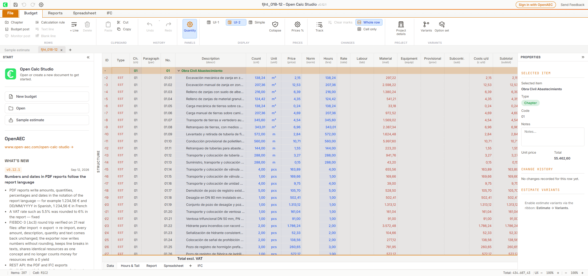

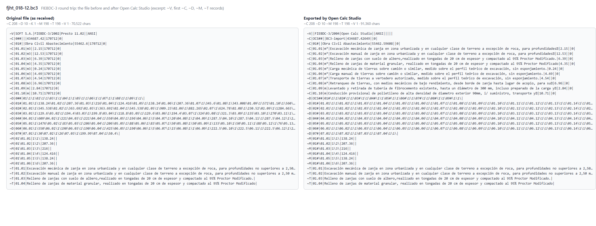

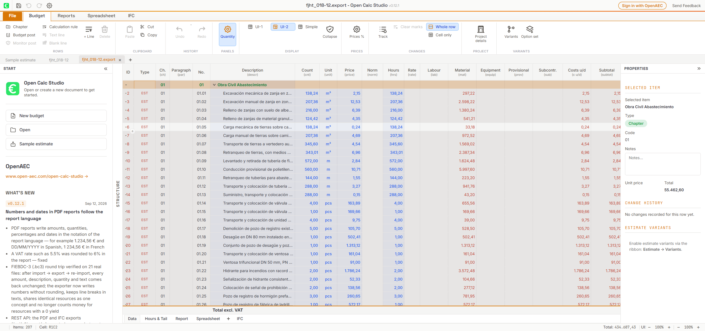

### corsam_presupuesto.bc3

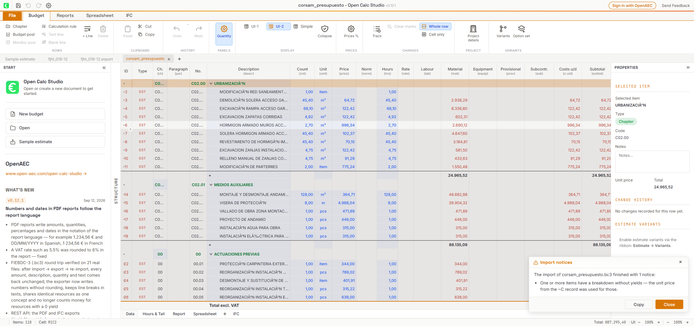

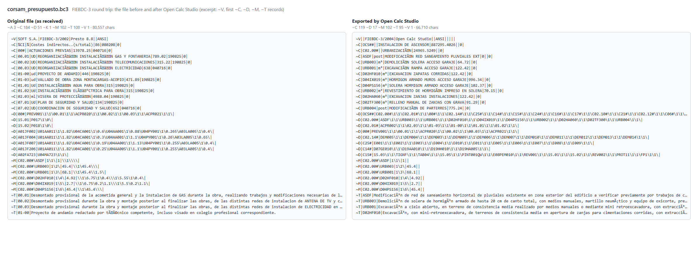

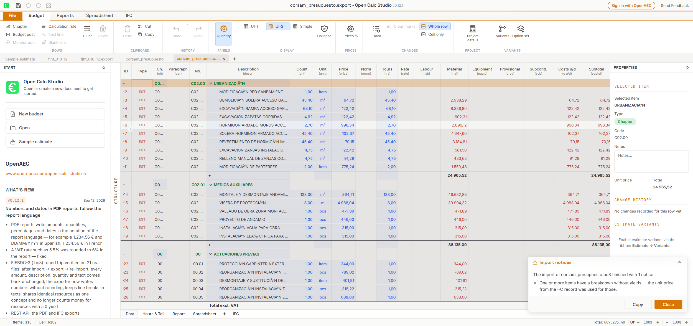

### pycost_test_file_05.bc3

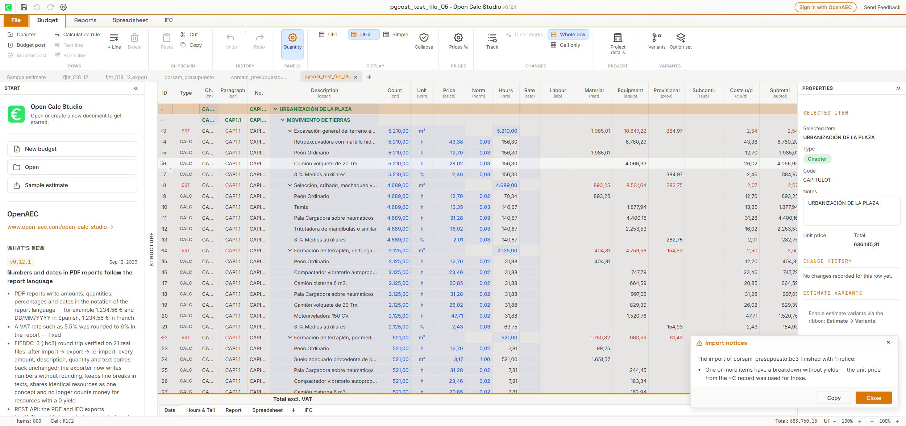

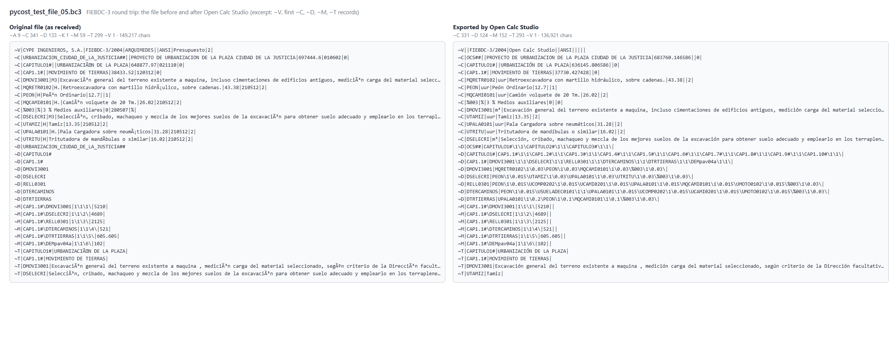

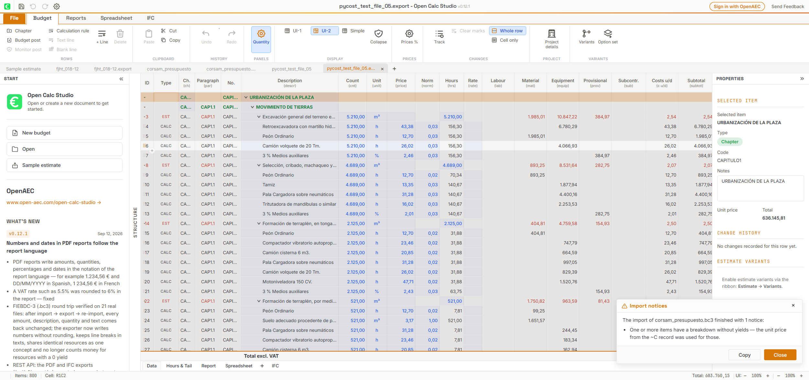

### pycost_sispre_PUEBLA-EE.bc3

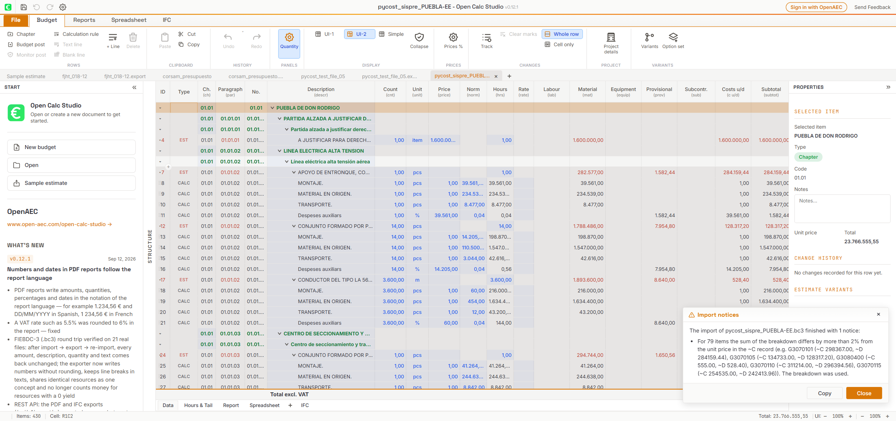

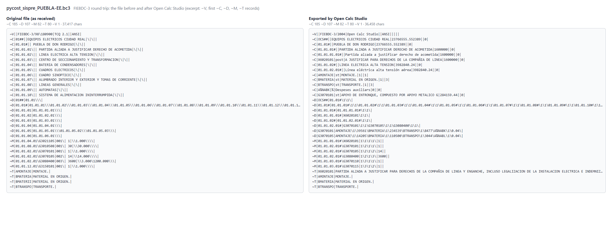


### pycost_measurement_outside_chapter.bc3

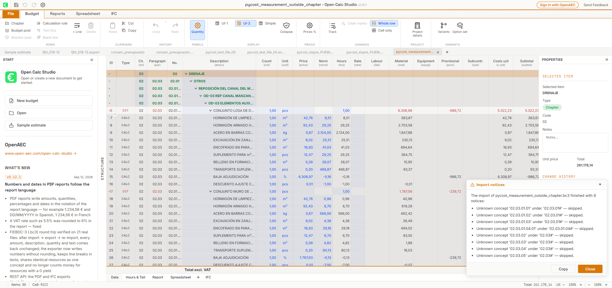

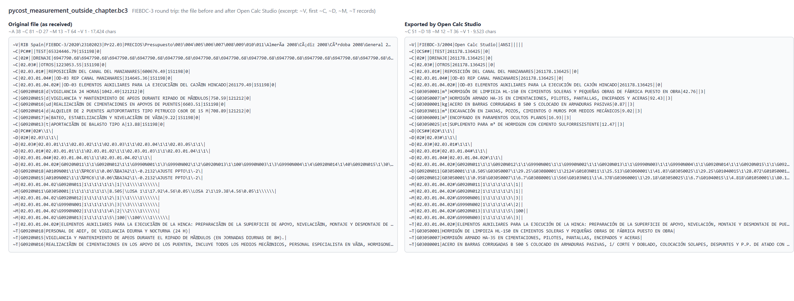

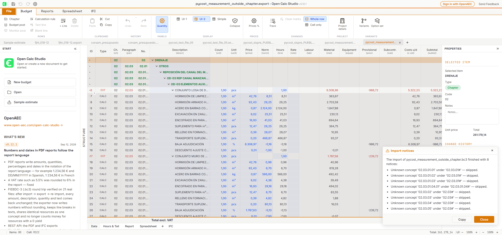

### pycost_guadix.bc3

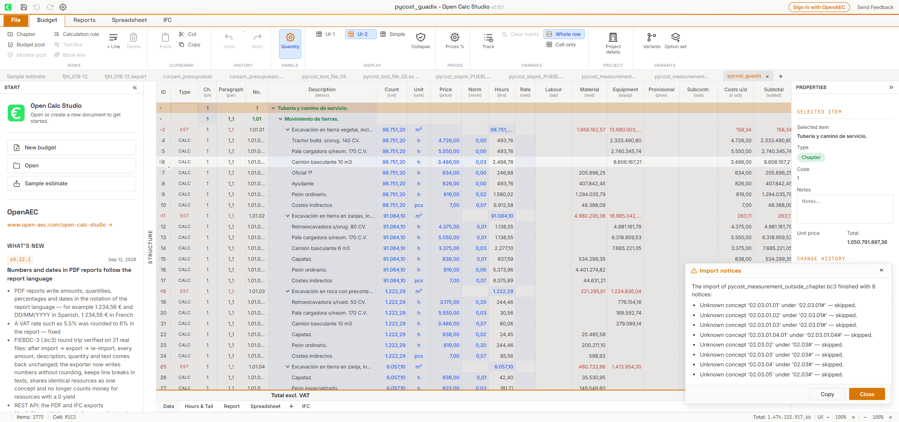

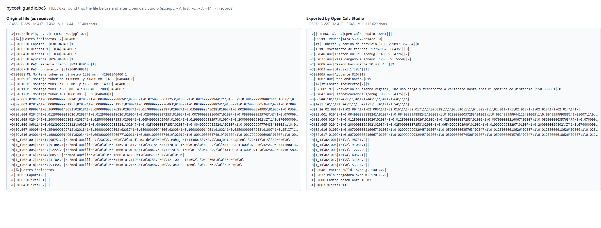

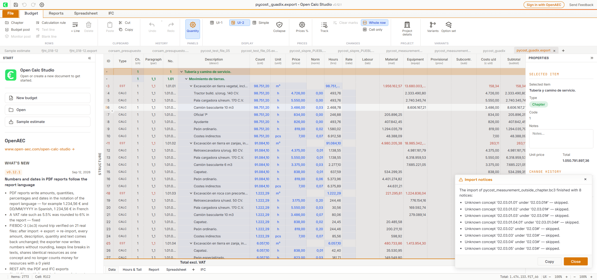

### tocbim_FirstStreet_corridor_PRES.bc3


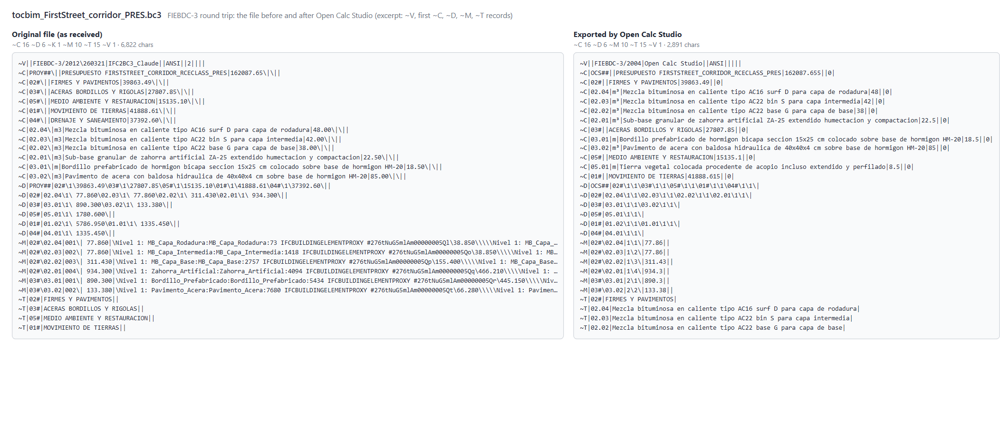

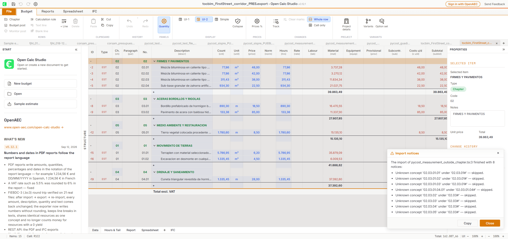

### BCCA2023_V02.bc3

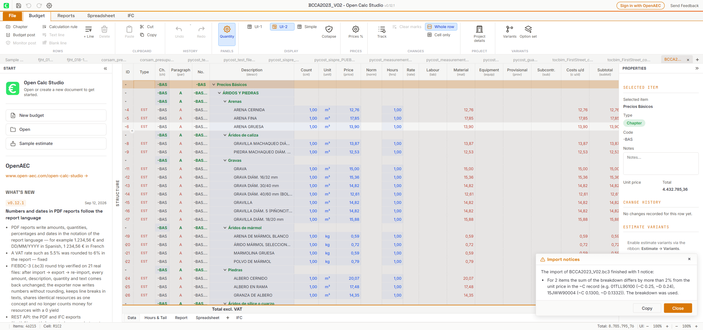

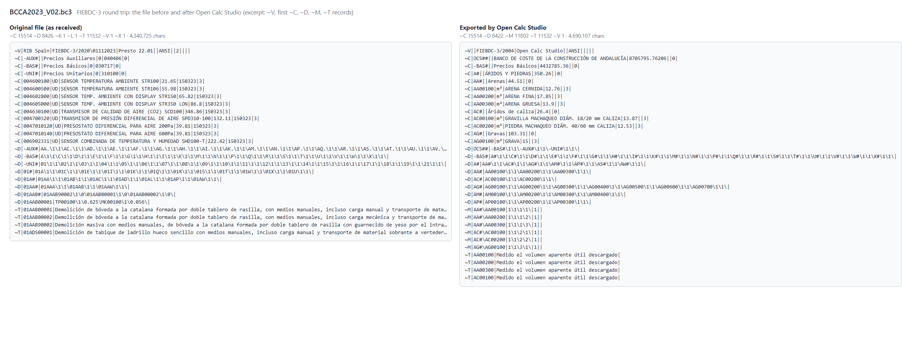

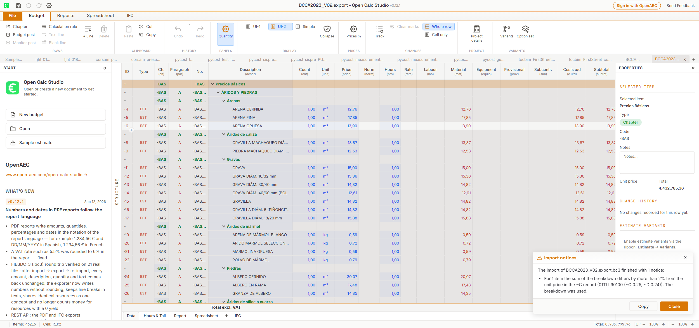

